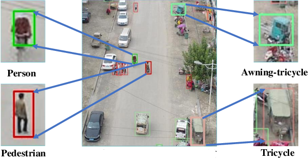

# Dataset Download scripts:
Three scripts have been provided for ease of access to download the original VisDrone dataset (un-optimised and non-class merged dataset), the fully optimised VisDrone dataset (from run_roboflow.py) and the original fisheye augmented version of VisDrone. The original VisDrone dataset is provided just to have an understanding of the contents of the dataset before it was optimised. I do not recommend using this dataset as the run_roboflow.py script will provide you with **10,100** cleaned up images of the VisDrone dataset, including both the first and second challenge (images and videos respectively).  

The following images shows an example where the **awning-tricycle** and **tricycle** classes were combined into **tricycle** to simplify the dataset and provide higher object instances. Similarly with **people** and **pedestrian** merged into **pedestrian**. Again, the run_roboflow.py script will only find this type of class merging. 

