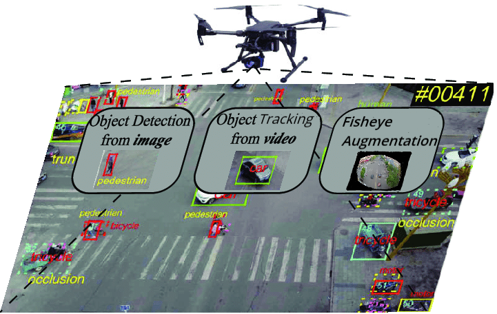

# Semantic Scene Parsing from Drones (Object Detection with Temporal Consistency from Unmanned Aerial Vehicles)

GitHub repository associated with the dissertation of Vinayak Unnithans's Master project completed at the Imperial College London for the fulfilment of the requirements for the degree of MSc Applied Machine Learning.

## Data Augmentation
The fisheye projection model chosen for this project can be applied to existing datasets using the scripts found in Fisheye Augmentation/.

## Datasets
To access the datasets used in this project, simply run the scripts found in the get_datasets/ directory.

## Models
All models are trained using standard YOLOv7 (as opposed to YOLOv7-tiny) and an input resolution of 960.

### Standard models (no augmentation) 
The weights/ directory will find the pre-trained weights that can be used to finetune further models. The following below are models that were trained for this project.

Trained on MS COCO: 
[`yolov7.pt`](https://github.com/man-like-vinny/Object-Detection-for-Drones/blob/main/weights/yolov7.pt)

Trained on the standard VisDrone dataset (first and second challenge - combined classes):
[`yolov7_visdrone_combination.pt`](https://github.com/man-like-vinny/Object-Detection-for-Drones/blob/main/weights/yolov7_visdrone_combination.pt)

Trained on standard VisDrone dataset (second challenge only): 
[`yolov7_visdrone_video.pt`](https://github.com/man-like-vinny/Object-Detection-for-Drones/blob/main/weights/yolov7_visdrone_video.pt)

### Fisheye distortion applied models
Trained on f=150: 
[`visdrone-combined-150.pt`](https://github.com/man-like-vinny/Object-Detection-for-Drones/blob/main/weights/visdrone-combined-150.pt)

Trained on f=300:
[`visdrone-combined-300.pt`](https://github.com/man-like-vinny/Object-Detection-for-Drones/blob/main/weights/visdrone-combined-300.pt)

## evaluation methods
The scripts found in Tracking Evaluation/ provide two methods of evaluation: Task4a and Task4b. Task4a requires no detection results and provides mAP results directly (groundtruth is required however). Task4b requires the detection results, which are used to compare against the groundtruth data.

## Results
The results for comparing the performance between standalone detector to a detector-tracker integration is found in the results/ directory. The primary metric that was used to highlight the performance increase was the F1 score. Feel free to use this as a benchmark against further improvements (in real time for example).

